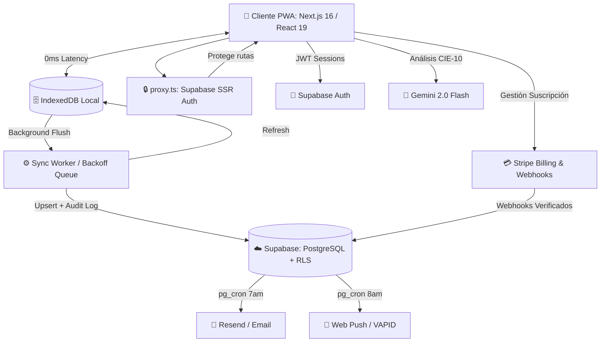

<div align="center">
  
  <h1>Glyph — Motor Clínico Inteligente ⚕️</h1>
  
  <p>
    <strong>Historia clínica electrónica SaaS: Offline-First, IA-Powered y Multi-tenant.</strong>
  </p>

  <p>
    <a href="https://nextjs.org/"></a>
    <a href="https://react.dev/"></a>
    <a href="https://supabase.com/"></a>
    <a href="https://stripe.com/"></a>
    <a href="https://playwright.dev/"></a>
  </p>
  
  <p>
    
    
    
    
    
    
  </p>

</div>

---

## 🌟 Visión General

**Glyph** es un **Motor Clínico Inteligente** para médicos modernos que exigen rapidez, seguridad y resiliencia tecnológica. Construido desde cero para funcionar en condiciones extremas: trabaja perfectamente sin conexión a internet y sincroniza automáticamente en la nube cuando la red vuelve.

Con arquitectura multi-tenant de grado empresarial, Glyph automatiza la facturación, los seguimientos y la codificación de enfermedades — devolviendo a los médicos su recurso más valioso: **el tiempo**.

---

## ✅ Estado Actual del Proyecto *(2026-05-13)*

> Build limpio. 0 errores TypeScript. 85/85 tests unitarios. 9 specs E2E.

### Features entregadas

| Feature | Descripción |
|---|---|
| **Consulta Wizard** | Flujo guiado 6 pasos → PDF con membrete. PAM auto-calculada, normalidad auto-completada. |
| **UI Adaptativa** | Secciones colapsables con memoria (JSONB) — el doctor ajusta el wizard a su especialidad. |
| **Constructor Posología** | Parsea texto libre con viñetas y lo convierte en tarjetas de medicación estructuradas automáticamente. |
| **Offline-First** | IndexedDB + sync worker con backoff exponencial |
| **Plan Multi-Doctor** | Arquitectura multi-tenant para Clínicas, roles de acceso (admin/doctor/viewer) y billing multi-seat. |
| **IA CIE-10** | Gemini 2.0 Flash sugiere diagnósticos en tiempo real |
| **Plantillas** | Multi-dispositivo en Supabase, versionado JSONB, historial restaurable |
| **Búsqueda Global** | `Ctrl+K` — FTS PostgreSQL con índices GIN + `websearch_to_tsquery` |
| **Dark Mode** | Toggle claro/oscuro/sistema, anti-flash (script pre-hydration) |
| **Notificaciones Push** | VAPID Web Push + cron SQL 8am UTC por seguimientos del día |
| **Recordatorios Email** | Resend API + cron SQL 7am UTC, template HTML branded |
| **Exportación ZIP** | Historia clínica completa: JSON + un PDF por consulta, 100% client-side |
| **Facturación** | Stripe Checkout, Webhooks firmados, Customer Portal |
| **Admin Panel** | Métricas de tenants, control de acceso por `ADMIN_EMAIL` |
| **Rate Limiting** | Por RPC Postgres en `/api/push/send` y `/api/stripe/*` |
| **Auditoría** | Hash criptográfico encadenado en cada consulta sellada |

### Próxima feature mayor

**Integraciones y Automatización Avanzada**: Interoperabilidad con laboratorios y mayor optimización de tareas diarias basadas en IA. Ver `docs/BACKLOG.md` para el detalle completo.

---

## 🚀 Características Principales

### 📶 Arquitectura Offline-First
- **Local-First:** Todo el motor clínico corre en el navegador usando **IndexedDB**, con tiempos de respuesta de 0ms.
- **Background Sync Queue:** Si se pierde la conexión, la app sigue funcionando. Las consultas y pacientes se encolan silenciosamente.
- **Worker Inteligente:** Al recuperar el internet, un sync worker despacha la cola hacia Supabase con *backoff exponencial* y resolución de conflictos por dependencias.
- **Online-First Refresh:** Refresh silencioso desde Supabase al cargar, manteniendo datos actualizados.

### 🤖 Asistente de IA — CIE-10
- **Gemini 2.0 Flash:** Lee los síntomas en tiempo real y sugiere diagnósticos con códigos **CIE-10** contextualizados.
- Rate Limiting por RPC Postgres — endpoint protegido por función que limita el uso por tenant.

### 🔍 Búsqueda Full-Text
- `Ctrl+K` abre el panel global con debounce de 280ms.
- Índices GIN sobre `tsvector` (`spanish`) en `patients` y `clinical_records`.
- RPC `search_global()` con `websearch_to_tsquery` y `ts_rank` para resultados por relevancia.

### 📦 Exportación ZIP de Historia Clínica
- Un clic en "Exportar ZIP" genera un archivo con:
  - `00_paciente.json` — datos demográficos
  - `index.json` — índice de consultas
  - Un PDF por cada consulta ordenado cronológicamente
- 100% client-side: los datos nunca pasan por un endpoint intermedio.
- Barra de progreso animada con estado por consulta.

### 🌙 Dark Mode
- Toggle: Claro / Oscuro / Sistema — persiste en `localStorage`.
- Script anti-flash embebido en `<head>` de `layout.tsx` aplica el tema antes del hydration.

### 📲 PWA y Notificaciones
- Instalable como app nativa en iOS, Android, macOS y Windows.
- **Web Push** a las 8am UTC con cron SQL `send_followup_push_daily`.
- **Email** (Resend) a las 7am UTC con cron SQL `send_followup_emails_daily`.

### 🔐 Seguridad
- RLS en todas las tablas — el backend nunca expone datos de otra clínica.
- Logs inmutables con hash criptográfico encadenado.
- CSP Headers estrictos en `next.config.ts`.
- Variables de entorno validadas en servidor con `src/lib/env.ts`.

---

## 🏗️ Arquitectura del Sistema



---

## 🛠️ Stack Tecnológico

| Componente | Tecnología |
| :--- | :--- |
| **Framework & UI** | Next.js 16 (App Router, Webpack), React 19, Tailwind CSS v4 |
| **Backend & BD** | Supabase (PostgreSQL), RLS, pg_cron, FTS con tsvector GIN |
| **Estado & Cache** | TanStack Query v5, IndexedDB (`idb`) |
| **Seguridad** | Supabase SSR proxy.ts, CSP Headers, HSTS, Stripe Signatures |
| **Machine Learning** | Google Gemini API (`gemini-2.0-flash`) |
| **Pagos** | Stripe API v2026-04-22, Webhooks, Customer Portal |
| **Notificaciones** | Web Push API, VAPID, Resend Email |
| **PDF / Export** | jsPDF 4.x, JSZip |
| **Testing** | Vitest (85 tests), Playwright (9 specs E2E) |

---

## 💻 Guía Rápida de Instalación

### 1. Clonar e instalar
```bash
git clone https://github.com/khryazid/HCE.git
cd HCE
npm install
```

### 2. Variables de Entorno (`.env.local`)
Duplica `.env.example` → `.env.local`. Variables requeridas:

```bash
# Supabase
NEXT_PUBLIC_SUPABASE_URL=
NEXT_PUBLIC_SUPABASE_ANON_KEY=
SUPABASE_SERVICE_ROLE_KEY=

# Stripe
STRIPE_SECRET_KEY=
STRIPE_WEBHOOK_SECRET=
NEXT_PUBLIC_STRIPE_PRICE_ID=
NEXT_PUBLIC_STRIPE_PUBLISHABLE_KEY=
NEXT_PUBLIC_SITE_URL=

# Gemini IA
GEMINI_API_KEY=
GEMINI_MODEL=gemini-2.0-flash

# VAPID (Push Notifications)
NEXT_PUBLIC_VAPID_PUBLIC_KEY=
VAPID_PRIVATE_KEY=
VAPID_MAILTO=mailto:soporte@tu-dominio.com
PUSH_SEND_SECRET=          # openssl rand -hex 32

# Email (Resend)
RESEND_API_KEY=             # re_xxxx desde resend.com
RESEND_EMAIL_SECRET=        # mismo valor que app_config.resend_email_secret
RESEND_FROM_EMAIL=          # Glyph <no-reply@tudominio.com>

# Admin Panel
ADMIN_EMAIL=tu-email@ejemplo.com

# Solo local — no va en Vercel
SUPABASE_ACCESS_TOKEN=sbp_xxxx
```

> ⚠️ `SUPABASE_SERVICE_ROLE_KEY`, `PUSH_SEND_SECRET` y `RESEND_EMAIL_SECRET` son exclusivos del servidor.

### 3. Base de Datos

El schema completo vive en un **único archivo SQL** (fuente de verdad):

```
supabase/migrations/000_production_full_schema.sql
```

**Aplicar en Supabase SQL Editor:**
1. Pegar el archivo completo → Run.
2. Actualizar `app_config` con valores reales:

```sql
insert into public.app_config (key, value) values
  ('site_url',           'https://TU-APP.vercel.app'),
  ('push_send_secret',   'TU_PUSH_SEND_SECRET'),
  ('resend_email_secret','TU_RESEND_EMAIL_SECRET')
on conflict (key) do update set value = excluded.value, updated_at = now();
```

3. Activar extensión `pg_cron` en Supabase → Database → Extensions.

**Regenerar tipos TypeScript** tras cualquier cambio de schema:
```bash
npm run db:types
```

### 4. Claves VAPID (primera vez)
```bash
npx web-push generate-vapid-keys
```

### 5. Lanzar en desarrollo
```bash
npm run dev
```

> **Nota:** `--webpack` en `npm run dev` es intencional. Turbopack tiene incompatibilidades con `next-pwa` y el sync worker.

---

## 🧪 Testing y QA

```bash
# TypeScript — 0 errores
npx tsc --noEmit

# ESLint
npm run lint

# Tests unitarios e integración (85 tests)
npm run test

# E2E en navegadores reales (requiere E2E_EMAIL + E2E_PASSWORD en .env.local)
npm run test:e2e

# E2E headless para un spec específico
npm run test:e2e -- tests/e2e/search.spec.ts
```

### Cobertura E2E (9 specs · ~22 tests)

| Spec | Cubre |
|---|---|
| `auth-consultation-pdf` | Login → consulta completa → PDF download |
| `billing` | Redirect a Stripe checkout/portal |
| `offline-sync` | IndexedDB offline → sync al reconectar |
| `treatments` | CRUD plantillas + historial versiones + restore |
| `search` | Ctrl+K, debounce, min-2-chars, arrow navigation |
| `patients` | Crear, buscar, filtro estado, contexto clínico |
| `theme` | Anti-flash, dark/light/sistema, localStorage |
| `settings` | Perfil, billing button, theme+push panel |
| `export-zip` | Botón visible, descarga .zip, disabled sin consultas |

---

## 📁 Estructura del Proyecto

```
src/
├── app/                    # Next.js App Router — páginas y API routes
│   ├── (auth)/             # Login, registro, onboarding
│   ├── (dashboard)/        # Dashboard, pacientes, consultas, admin, ajustes, tratamientos
│   └── api/                # Stripe, push, email, search, IA CIE-10
├── features/               # Lógica de negocio por dominio
│   ├── admin/              # Panel super admin
│   ├── auth/               # Formularios y flujos de autenticación
│   ├── billing/            # Integración Stripe + portal
│   ├── consultations/      # Wizard, PDF, generateConsultationPdfBlob, IA CIE, plantillas
│   ├── dashboard/          # Métricas, búsqueda global Ctrl+K, letterhead, ThemeToggle
│   ├── patients/           # CRUD pacientes, ExportZipButton, export-zip.ts
│   └── sync/               # Bootstrap del sync worker
├── lib/
│   ├── constants/          # Especialidades médicas y constantes
│   ├── db/                 # IndexedDB schema + queries locales
│   ├── env.ts              # Validación de variables de entorno al arrancar
│   ├── hooks/use-theme.ts  # Hook de dark mode con lazy initializer
│   ├── observability/      # Logger de errores, usage-tracker
│   ├── supabase/           # Cliente SSR/browser, profile, tenant, onboarding
│   └── sync/               # Sync worker con backoff exponencial
├── components/ui/          # ThemeToggle, EmptyState, etc.
├── proxy.ts                # Proxy SSR de Next.js 16 (reemplaza middleware.ts)
└── types/supabase.types.ts # Generado con npm run db:types
supabase/
└── migrations/
    └── 000_production_full_schema.sql   # Única fuente de verdad del schema
tests/
├── e2e/                    # Playwright specs (9 archivos)
│   └── helpers/login.ts    # Helper compartido de autenticación
└── *.test.ts               # Vitest: 85 tests unitarios/integración
docs/
├── BACKLOG.md              # Sprint actual + bugs + próximas features
├── SUPABASE_MIGRATIONS.md  # Guía para añadir tablas y regenerar tipos
├── DESIGN_SYSTEM.md        # Tokens de diseño y componentes UI
└── 001-ADR-arquitectura-base.md
```

---

## 📋 Scripts Disponibles

| Script | Descripción |
|--------|-------------|
| `npm run dev` | Servidor de desarrollo (webpack) |
| `npm run build` | Build de producción |
| `npm run lint` | ESLint sobre todo `src/` |
| `npm run typecheck` | TypeScript sin emitir archivos |
| `npm run test` | Suite Vitest (85 tests) |
| `npm run test:e2e` | Suite Playwright E2E (9 specs) |
| `npm run test:e2e:headed` | E2E con navegador visible |
| `npm run db:types` | Regenera `src/types/supabase.types.ts` desde Supabase |

---

## 🗺️ Próximas Features

Ver el tasklist completo con prioridades en **[docs/BACKLOG.md](docs/BACKLOG.md)**.

La siguiente feature mayor:

**W-08 — Citas y Calendario Avanzado**
- Creación rápida de pacientes desde el flujo de Walk-In
- Control de arrastrar y soltar (Drag & Drop)
- Estados de asistencia integrados al wizard clínico

---

<div align="center">
  <br>
  <strong>Hecho con ❤️ para revolucionar la tecnología en salud digital.</strong>
  <br><br>
  <sub>Distribuido bajo licencia MIT.</sub>
</div>
