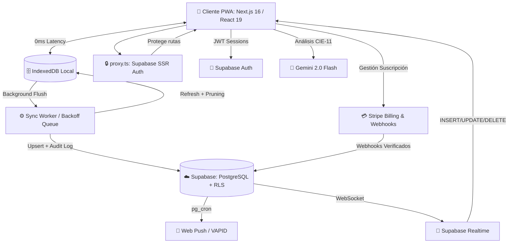

<div align="center">
  
  <h1>Glyphix — Motor Clínico Inteligente ⚕️</h1>
  
  <p>
    <strong>Historia clínica electrónica SaaS: Offline-First, IA-Powered y Multi-tenant.</strong>
  </p>

  <p>
    <a href="https://nextjs.org/"></a>
    <a href="https://react.dev/"></a>
    <a href="https://supabase.com/"></a>
    <a href="https://stripe.com/"></a>
    <a href="https://playwright.dev/"></a>
  </p>
</div>

---

## 🌟 Visión General

**Glyphix** es un software médico moderno diseñado para garantizar la continuidad operativa bajo cualquier condición de red. Construido desde cero bajo el paradigma **Offline-First**, funciona sin conexión a internet y sincroniza automáticamente los datos en la nube (Supabase) cuando se recupera la red.

Con una arquitectura **Multi-tenant de grado empresarial**, Glyphix soporta desde consultorios independientes hasta clínicas completas con diferentes departamentos, manejando facturación, agendamiento y codificación inteligente de enfermedades (CIE-11 asistido por IA).

Este repositorio es la **única fuente de la verdad** para el código base. Si eres un nuevo desarrollador integrándote al equipo, este documento te dará todo el contexto necesario para entender cómo funciona la aplicación bajo el capó.

---

## 🏗️ Arquitectura del Sistema

La arquitectura de Glyphix está diseñada para resiliencia extrema y baja latencia, combinando tecnologías de cliente pesado (Local-First) con un backend en tiempo real.



### 1. Motor Offline-First
En lugar de hacer peticiones HTTP bloqueantes a una API REST, el cliente (React) lee y escribe directamente contra **IndexedDB** (`src/lib/db`). Esto garantiza que la UI responda en 0ms y que el médico pueda seguir atendiendo pacientes si se cae el internet. 

En segundo plano, un **Sync Worker** intercepta estos cambios locales, los encola y los sincroniza con PostgreSQL (Supabase) usando una estrategia de *backoff exponencial* (reintentos automáticos si falla la red).

### 2. Autenticación y Route Guards (SSR)
Next.js utiliza `src/proxy.ts` como Middleware. Antes de que el servidor envíe el HTML al cliente, verifica la sesión JWT de Supabase Auth. Si el usuario no está logueado, lo redirige al login. Adicionalmente, el cliente implementa el `<RoleGuard>` basado en `src/lib/guards/route-guard.ts` para denegar el acceso a rutas que no corresponden al rol del usuario.

### 3. Base de Datos Híbrida (Supabase)
Todo el estado remoto vive en PostgreSQL. La separación de inquilinos (Tenants) se garantiza estrictamente mediante **Row Level Security (RLS)**. El schema principal está documentado en `supabase/migrations/000_production_full_schema.sql`, seguido de migraciones incrementales.

---

## 🛡️ RBAC y Modelo Multi-Tenant

Glyphix opera como un SaaS multi-tenant. Un usuario pertenece a una organización (clínica) y tiene un **Rol** específico. La base de datos mediante RLS asegura que un usuario jamás pueda ver datos clínicos de otro tenant, ni siquiera haciendo peticiones HTTP directas saltándose el frontend.

### Los 8 Roles del Sistema
El sistema maneja permisos granulares basados en roles:

| Rol | Dashboard | Nivel de Acceso |
|-----|-----------|-----------------|
| `owner` | `/dashboard` | Acceso total. Propietario de la clínica, ve facturación (Stripe) y administra al equipo. |
| `doctor` | `/dashboard` | Médico tratante. Acceso clínico completo a sus pacientes y consultas. |
| `assistant` | `/agenda` | Asistente médico. Gestiona agenda y caja. No ve datos clínicos salvo permiso expreso. |
| `clinic_admin` | `/administracion`| Administrador. Solo gestiona la clínica, facturación y equipo. **Cero acceso a datos médicos.** |
| `receptionist` | `/recepcion` | Recepción. Solo puede agendar citas en los horarios de médicos que lo hayan autorizado. |
| `lab` | `/laboratorio` | Técnico de Laboratorio. Procesa órdenes médicas de tipo laboratorio. |
| `imaging` | `/imagen` | Técnico de Imagenología. Procesa órdenes de estudios de imagen. |
| `surgery` | `/cirugia` | Personal Quirúrgico. Procesa y aprueba solicitudes de cirugía. |

*(Adicionalmente existe un `Platform Admin` o Súper Administrador que tiene acceso global a `/platform` para gestionar suscripciones SaaS).*

---

## 🚀 Funcionalidades Principales

- **Asistente IA CIE-11**: Integración con *Gemini 2.0 Flash* que lee la anamnesis en tiempo real y sugiere códigos de diagnóstico oficiales de la OMS.
- **Exportación ZIP Client-Side**: Generación de expedientes médicos completos (PDFs y JSON) directamente en el navegador sin que los datos viajen a servidores de terceros, garantizando privacidad (HIPAA/GDPR).
- **Agenda Reactiva Realtime**: Calendario de turnos usando *Supabase Realtime* vía WebSockets. Los recepcionistas y doctores ven actualizarse sus calendarios sin recargar la página.
- **Flujo de Caja Aislado**: Cada asistente o recepcionista abre un "Turno de caja" (`cash_shifts`). Todo cobro se registra con auditoría inmutable.
- **Onboarding Automático**: Los nuevos registros pasan por una secuencia forzada (Setup de Perfil → Membrete → Especialidad) antes de poder operar.
- **Notificaciones Cron**: Uso de `pg_cron` dentro de PostgreSQL para procesar la base de datos a las 7 AM y 8 AM UTC y disparar recordatorios por *Resend* (Email) y *VAPID* (Web Push).
- **Full Text Search**: Búsqueda global (`Ctrl+K`) super-rápida implementada nativamente en PostgreSQL con índices GIN y `tsvector`.

---

## 🛠️ Stack Tecnológico

| Capa | Tecnología |
| :--- | :--- |
| **Framework UI** | Next.js 16 (App Router), React 19, Tailwind CSS v4, Lucide Icons |
| **Backend / DB** | Supabase (PostgreSQL), Row Level Security (RLS) |
| **Data Fetching**| TanStack Query v5, IndexedDB |
| **Manejo de Formularios**| React Hook Form, Zod v4 |
| **Infraestructura Pagos**| Stripe API (Customer Portal, Checkouts, Webhooks) |
| **Generación de PDFs** | jsPDF, html2canvas, JSZip |
| **Testing** | Vitest (unitarios), Playwright (E2E) |

---

## 📁 Estructura del Código Base

Glyphix sigue una arquitectura de **Vertical Slices** (carpetas por funcionalidad) dentro de la carpeta `features`, lo que mantiene todo el código relacionado (hooks, componentes, tipos) altamente cohesivo.

```text
src/
├── app/                    # Enrutamiento de Next.js (App Router)
│   ├── (auth)/             # Páginas públicas (Login, Registro, Recuperación)
│   ├── (dashboard)/        # Páginas privadas de la clínica protegidas por el Route Guard
│   ├── (platform)/         # Panel de super administración global
│   └── api/                # API Routes (Stripe Webhooks, Gemini IA, Push, Email)
│
├── features/               # Lógica de dominio dividida por "Feature" (Vertical Slice)
│   ├── agenda/             # Componentes del calendario y agendamiento
│   ├── auth/               # Hooks y UI de autenticación
│   ├── clinic-admin/       # Gestión del equipo y dashboard gerencial
│   ├── consultations/      # El Wizard de Consulta Clínica (Corazón del sistema)
│   ├── department-orders/  # Sistema unificado de órdenes para Laboratorio/Imagen/Cirugía
│   ├── patients/           # Base de datos local de pacientes
│   └── settings/           # Configuración del doctor y membretes
│
├── components/             # Componentes UI globales (Botones, Inputs, Modales genéricos)
│
├── lib/                    # Utilidades puras, constantes y configuración
│   ├── db/                 # Configuración de IndexedDB
│   ├── guards/             # Lógica del RouteGuard y RBAC
│   ├── supabase/           # Clientes de Supabase y contexto del Tenant
│   └── sync/               # Motor del Sync Worker
│
├── types/                  # Tipos TypeScript compartidos (supabase.types.ts)
└── proxy.ts                # El Middleware SSR de Next.js
```

---

## 💻 Guía de Inicio para Desarrolladores

Para arrancar el proyecto localmente, necesitas configurar el entorno de Node.js, las variables de entorno de Supabase y Stripe.

👉 **Consulta la guía de instalación rápida en: [docs/SETUP.md](docs/SETUP.md)**

### Scripts Útiles en el Día a Día

```bash
# Iniciar servidor local (siempre usar webpack, no --turbo para PWA)
npm run dev

# Chequeo estricto de TypeScript en todo el proyecto
npm run typecheck

# Linting
npm run lint

# Sincronizar tipos de TypeScript desde la base de datos de Supabase
npm run db:types

# Ejecutar tests unitarios (Vitest)
npm run test

# Ejecutar tests End-to-End (Playwright)
npm run test:e2e
```

---

<div align="center">
  <br>
  <strong>Hecho para revolucionar la salud digital.</strong>
  <br>
</div>
