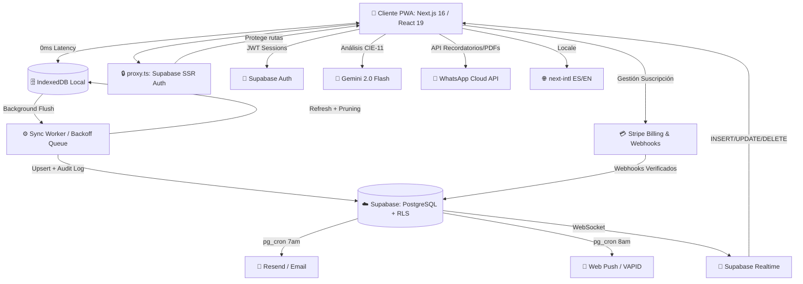

<div align="center">
  
  <h1>Glyphix — Motor Clínico Inteligente ⚕️</h1>
  
  <p>
    <strong>Historia clínica electrónica SaaS: Offline-First, IA-Powered y Multi-tenant.</strong>
  </p>

  <p>
    <a href="https://nextjs.org/"></a>
    <a href="https://react.dev/"></a>
    <a href="https://supabase.com/"></a>
    <a href="https://stripe.com/"></a>
    <a href="https://playwright.dev/"></a>
  </p>
  
  <p>
    
    
    
    
    
    
    
  </p>

</div>

---

## 🌟 Visión General

**Glyphix** es un **Motor Clínico Inteligente** para médicos modernos que exigen rapidez, seguridad y resiliencia tecnológica. Construido desde cero para funcionar en condiciones extremas: trabaja perfectamente sin conexión a internet y sincroniza automáticamente en la nube cuando la red vuelve.

Con arquitectura multi-tenant de grado empresarial, Glyphix automatiza la facturación, los seguimientos y la codificación de enfermedades — devolviendo a los médicos su recurso más valioso: **el tiempo**.

---

## ✅ Estado Actual del Proyecto *(2026-05-28)*

> Build limpio · 0 errores TypeScript · Build de producción OK · **Versión 1.0.0 (Producción)**

### Features entregadas

| Feature | Descripción |
|---|---|
| **Consulta Wizard** | Flujo guiado 6 pasos → PDF con membrete. PAM auto-calculada, normalidad auto-completada. |
| **UI Adaptativa (Clinical Rompecabezas)** | Secciones colapsables con memoria (JSONB) — el especialista configura el wizard a su flujo. |
| **Constructor Posología** | Parsea texto libre con viñetas y lo convierte en tarjetas de medicación estructuradas. |
| **Offline-First** | IndexedDB + sync worker con backoff exponencial. Eliminaciones remotas se propagan al cache local. |
| **Realtime Sync** | Supabase WebSocket Realtime en 5 tablas (pacientes, citas, consultas, equipo, plantillas). |
| **Agenda Reactiva** | Calendario con polling 30s + `refetchOnWindowFocus` + Realtime — el médico ve citas nuevas al instante. Diseño high-density clínico con notificaciones contextuales. |
| **Plan Multi-Doctor** | Multi-tenant para Clínicas, roles (admin/doctor/viewer) y billing multi-seat. |
| **IA CIE-11** | Gemini 2.0 Flash sugiere diagnósticos en tiempo real |
| **Plantillas** | Multi-dispositivo en Supabase, versionado JSONB, historial restaurable |
| **Búsqueda Global** | `Ctrl+K` — FTS PostgreSQL con índices GIN + `websearch_to_tsquery` |
| **Dark Mode** | Toggle claro/oscuro/sistema, anti-flash (script pre-hydration) |
| **Notificaciones Push** | VAPID Web Push + cron SQL 8am UTC por seguimientos del día |
| **Recordatorios Email** | Resend API + cron SQL 7am UTC, template HTML branded |
| **Caja y Turnos** | Control de flujo de caja aislado (`cash_shifts`), auditoría de ingresos/egresos y cuadre final. |
| **Laboratorio** | Órdenes de laboratorio, adjunto de resultados técnicos y envío de PDFs por WhatsApp al paciente. |
| **Integraciones Core** | Meta Graph API (WhatsApp) para recordatorios y PDFs. Resend para invitaciones corporativas (Magic Links). |
| **Exportación ZIP** | Historia clínica completa: JSON + un PDF por consulta, 100% client-side |
| **Facturación** | Stripe Checkout, Webhooks firmados, Customer Portal |
| **Admin Panel** | Métricas de tenants, control de acceso por `ADMIN_EMAIL`. Gestión masiva de clínicas. |
| **Config. Global** | T&C Dinámicos en Markdown, Modo Mantenimiento Global, Avisos Persistentes en Dashboard. |
| **Rate Limiting** | Por RPC Postgres en `/api/push/send` y `/api/stripe/*` |
| **Auditoría** | Hash criptográfico encadenado en cada consulta sellada |
| **Validación de Fechas** | Utilidad `toISODateString` — previene error PostgreSQL 22008 en todos los formularios |
| **Recuperación de Contraseña** | Flujo completo de reset vía email con Supabase Auth (`/recuperar`) |
| **Onboarding Wizard** | Secuencia forzada de configuración inicial — perfil profesional, especialidad, membrete — antes de acceder al dashboard |
| **i18n (ES/EN)** | Internacionalización con `next-intl`, mensajes en español e inglés |
| **Cifrado & GDPR** | Migraciones de cifrado de datos sensibles y cumplimiento de protección de datos |
| **Notificaciones de Agenda** | Cron SQL para recordatorios automáticos de citas próximas |
| **Documentación In-App** | Manual HTML para médicos accesible desde `/docs` dentro del dashboard |
| **UX/UI Premium** | Navegación Topnav, landing page rediseñada con Sticky Scroll Showcase, auth centrada en card, settings con sidebar, animaciones fluidas y Skeletons |

### Últimas mejoras (mayo 2026)

- **Expansión del Super Admin** — Gestión masiva de clínicas y suscripciones. Configuración de avisos globales y "Modo Mantenimiento".
- **T&C en Markdown** — Los términos y condiciones ahora se pueden editar directamente desde el panel subiendo archivos `.md` y versionándolos de forma dinámica sin tocar código.
- **Rediseño completo de UI** — Landing page con secciones animadas y Sticky Scroll, auth centrada, dashboard con Topnav, agenda high-density, settings con navegación lateral, modales de cita rediseñados.
- **Onboarding forzado** — Wizard de configuración secuencial obligatoria para nuevos médicos.
- **Auto-healing de perfiles** — Si el perfil del tenant falta, se recrea automáticamente al guardar perfil profesional.
- **Autocomplete de especialidades** — Dropdown con búsqueda en ajustes del perfil.
- **Correcciones de hydration SSR** — Resueltos todos los mismatches de hydration en ThemeScript, SyncStatusBanner y layout.

---

## 🚀 Características Principales

### 📶 Arquitectura Offline-First
- **Local-First:** Todo el motor clínico corre en el navegador usando **IndexedDB**, con tiempos de respuesta de 0ms.
- **Background Sync Queue:** Si se pierde la conexión, la app sigue funcionando. Las consultas y pacientes se encolan silenciosamente.
- **Worker Inteligente:** Al recuperar el internet, un sync worker despacha la cola hacia Supabase con *backoff exponencial* y resolución de conflictos por dependencias.
- **Online-First Refresh:** Refresh silencioso desde Supabase al cargar, manteniendo datos actualizados.

### 🤖 Asistente de IA — CIE-11
- **Gemini 2.0 Flash:** Lee los síntomas en tiempo real y sugiere diagnósticos con códigos **CIE-11** contextualizados.
- Rate Limiting por RPC Postgres — endpoint protegido por función que limita el uso por tenant.

### 🔍 Búsqueda Full-Text
- `Ctrl+K` abre el panel global con debounce de 280ms.
- Índices GIN sobre `tsvector` (`spanish`) en `patients` y `clinical_records`.
- RPC `search_global()` con `websearch_to_tsquery` y `ts_rank` para resultados por relevancia.

### 📦 Exportación ZIP de Historia Clínica
- Un clic en "Exportar ZIP" genera un archivo con:
  - `00_paciente.json` — datos demográficos
  - `index.json` — índice de consultas
  - Un PDF por cada consulta ordenado cronológicamente
- 100% client-side: los datos nunca pasan por un endpoint intermedio.
- Barra de progreso animada con estado por consulta.

### 🌙 Dark Mode
- Toggle: Claro / Oscuro / Sistema — persiste en `localStorage`.
- Script anti-flash embebido en `<head>` de `layout.tsx` aplica el tema antes del hydration.

### 📲 PWA y Notificaciones
- Instalable como app nativa en iOS, Android, macOS y Windows.
- **Web Push** a las 8am UTC con cron SQL `send_followup_push_daily`.
- **Email** (Resend) a las 7am UTC con cron SQL `send_followup_emails_daily`.
- **Notificaciones de Agenda** — Recordatorios automáticos de citas próximas vía cron SQL.

### 🌐 Internacionalización
- Soporte ES/EN con `next-intl`.
- Detección automática de locale y API route `/api/locale` para cambio dinámico.

### 🔐 Seguridad
- RLS en todas las tablas — el backend nunca expone datos de otra clínica.
- Logs inmutables con hash criptográfico encadenado.
- CSP Headers estrictos en `next.config.ts`.
- Variables de entorno validadas en servidor con `src/lib/env.ts`.
- Migraciones de cifrado y cumplimiento GDPR para datos sensibles de pacientes.

---

## 💼 Planes, Roles y Enrutamiento Base

El proyecto se distribuye bajo un modelo SaaS con dos niveles de suscripción manejados vía Stripe, los cuales dictan el acceso y los roles disponibles dentro de la plataforma.

### 1. Plan Profesional Independiente
Diseñado para médicos con consultorio propio o atención en un solo asiento.
- **Características:** Pacientes ilimitados, consultas sin restricciones, sugerencias diagnósticas IA (CIE-11), sincronización offline-first, PDF profesional y soporte básico.
- **Roles:** El médico es el administrador de su propio espacio de trabajo.
- **Flujo:** Al registrarse, entra directo al *Onboarding* individual y su entorno es completamente privado y aislado.

### 2. Plan Clínica (Multi-Tenant)
Diseñado para centros médicos, clínicas y agrupaciones con múltiples profesionales trabajando bajo la misma marca.
- **Características:** Incluye todo lo del Plan Profesional, más la capacidad de agrupar médicos, centralizar facturación, compartir base de pacientes (opcional), flujo de caja unificado y reportes gerenciales.
- **Roles y Permisos:**
  - **Dueño / Super Administrador:** Acceso total. Puede invitar personal, ver facturación central (Stripe), ver reportes de ingresos (`/clinic-dashboard`) y acceder a todas las configuraciones.
  - **Médico Adscrito:** Tiene acceso a la agenda, a crear pacientes, iniciar consultas (Wizard) y ver su propio historial. No ve métricas financieras de la clínica ni facturación.
  - **Administrativo / Recepcionista:** Puede agendar citas, admitir pacientes, y abrir/cerrar turnos de caja (`cash_shifts`), pero no puede alterar historias clínicas.
  - **Técnico de Laboratorio:** Acceso restringido al módulo `/laboratorio` para subir PDFs de resultados y enviarlos por WhatsApp.

### Estructura de Rutas Clave (App Router)
La navegación está protegida por un **Route Guard (`src/proxy.ts`)** que intercepta las sesiones SSR en lugar del frágil `middleware.ts`.
- **Rutas Públicas:** `/` (Landing), `/login`, `/registro` (bifurcado por `?plan=`), `/recuperar`, `/terminos`.
- **Rutas Privadas (`/dashboard/`)**:
  - `/dashboard`: Panel central del médico (Métricas, atajos ⌘K, citas del día).
  - `/clinic-dashboard`: Panel gerencial exclusivo para dueños de clínicas.
  - `/agenda`: Calendario reactivo, gestión de "walk-ins" y recordatorios (WhatsApp).
  - `/consultas`: Wizard paso a paso (Anamnesis, Examen, CIE-11, Receta).
  - `/pacientes`: Base de pacientes sincronizada offline (IndexedDB).
  - `/laboratorio`: Procesamiento de órdenes médicas y envío directo al paciente.
  - `/caja`: Control de turnos de efectivo (`cash_shifts`) con apertura y cierre aislado.
  - `/ajustes`: Drag & Drop de plantillas médicas (Rompecabezas) y gestión de equipo (invitaciones por Resend).
  - `/billing`: Customer Portal de Stripe incrustado.

---

## 🏗️ Arquitectura del Sistema



---

## 🛠️ Stack Tecnológico

| Componente | Tecnología |
| :--- | :--- |
| **Framework & UI** | Next.js 16 (App Router, Webpack), React 19, Tailwind CSS v4 |
| **Backend & BD** | Supabase (PostgreSQL), RLS, pg_cron, FTS con tsvector GIN |
| **Estado & Cache** | TanStack Query v5, IndexedDB (`idb`) |
| **Seguridad** | Supabase SSR proxy.ts, CSP Headers, HSTS, Stripe Signatures, Cifrado GDPR |
| **Machine Learning** | Google Gemini API (`gemini-2.0-flash`) |
| **Pagos** | Stripe API v2026-04-22, Webhooks, Customer Portal |
| **Notificaciones** | Web Push API, VAPID, Resend Email, Agenda Cron |
| **i18n** | next-intl (ES/EN) |
| **PDF / Export** | jsPDF 4.x, JSZip |
| **Validación** | Zod v4 + React Hook Form |
| **Testing** | Vitest (125 tests), Playwright (9 specs E2E) |

---

## 💻 Guía Rápida de Instalación

La guía de instalación paso a paso, configuración de variables de entorno, base de datos local y directrices de despliegue se ha movido a la documentación interna para desarrolladores.

Por favor, para iniciar localmente en menos de 30 minutos consulta:
👉 **[docs/SETUP.md](docs/SETUP.md)**

---

## 🧪 Testing y QA

```bash
# TypeScript — 0 errores
npx tsc --noEmit

# ESLint
npm run lint

# Tests unitarios e integración (125 tests)
npm run test

# E2E en navegadores reales (requiere E2E_EMAIL + E2E_PASSWORD en .env.local)
npm run test:e2e

# E2E headless para un spec específico
npm run test:e2e -- tests/e2e/search.spec.ts
```

### Cobertura E2E (9 specs · ~22 tests)

| Spec | Cubre |
|---|---|
| `auth-consultation-pdf` | Login → consulta completa → PDF download |
| `billing` | Redirect a Stripe checkout/portal |
| `offline-sync` | IndexedDB offline → sync al reconectar |
| `treatments` | CRUD plantillas + historial versiones + restore |
| `search` | Ctrl+K, debounce, min-2-chars, arrow navigation |
| `patients` | Crear, buscar, filtro estado, contexto clínico |
| `theme` | Anti-flash, dark/light/sistema, localStorage |
| `settings` | Perfil, billing button, theme+push panel |
| `export-zip` | Botón visible, descarga .zip, disabled sin consultas |

---

## 📁 Estructura del Proyecto

```
src/
├── app/                    # Next.js App Router — páginas y API routes
│   ├── (auth)/             # Login, registro, recuperación de contraseña
│   ├── (dashboard)/        # Dashboard, pacientes, consultas, agenda, admin, ajustes, tratamientos, docs
│   ├── api/                # Stripe, push, email, search, IA CIE-11, clinic, locale, auth
│   ├── landing-client.tsx  # Landing page con Sticky Scroll Showcase
│   ├── privacidad/         # Página de política de privacidad
│   └── terminos/           # Página de términos y condiciones
├── features/               # Lógica de negocio por dominio (Vertical Slice)
│   ├── admin/              # Panel super admin
│   ├── agenda/             # Calendario, citas, modales de agenda, Recordatorios WhatsApp
│   ├── auth/               # Formularios y flujos de autenticación
│   ├── billing/            # Integración Stripe + portal
│   ├── cash-flow/          # Flujo de caja y control de turnos aislados
│   ├── clinic-admin/       # Dashboard administrativo de clínicas
│   ├── consultations/      # Wizard, PDF, IA CIE, plantillas, realtime
│   ├── dashboard/          # Métricas, búsqueda global Ctrl+K, Topnav, letterhead, equipo, onboarding guard
│   ├── lab-orders/         # Gestión de órdenes de laboratorio, envíos de resultados vía WhatsApp
│   ├── onboarding/         # Setup de nuevos tenants y doctores
│   ├── patients/           # CRUD pacientes, ExportZip, realtime hooks
│   ├── referrals/          # Catálogo referencial de especialidades/CIE
│   ├── settings/           # Configuración de cuenta, integraciones
│   └── sync/               # Bootstrap del sync worker
├── i18n/                   # Configuración de next-intl
├── lib/
│   ├── api/                # Utilidades de API compartidas
│   ├── config.ts           # Configuración global de la app
│   ├── constants/          # Especialidades médicas y constantes
│   ├── db/                 # IndexedDB schema + queries locales con pruning remoto
│   ├── env.ts              # Validación de variables de entorno al arrancar
│   ├── hooks/              # Hooks reutilizables (dark mode, etc.)
│   ├── observability/      # Logger de errores, usage-tracker
│   ├── supabase/           # Cliente SSR/browser, profile, tenant, onboarding, auth-actions
│   ├── sync/               # Sync worker con backoff exponencial
│   ├── ui/                 # Utilidades UI (feedback-copy, format-date)
│   ├── utils/              # Validación/conversión de fechas, utilidades generales
│   └── whatsapp/           # Formateador de mensajes WhatsApp
├── components/ui/          # ThemeToggle, ThemeScript, EmptyState, ConfirmModal, Skeletons, Sheet, etc.
├── proxy.ts                # Proxy SSR de Next.js 16 (reemplaza middleware.ts)
└── types/supabase.types.ts # Generado con npm run db:types
messages/
├── es.json                 # Traducciones en español
└── en.json                 # Traducciones en inglés
worker/
└── index.ts                # Service Worker / Sync Worker
supabase/
└── migrations/
    ├── 000_production_full_schema.sql   # Única fuente de verdad del schema
    ├── 001_add_client_timestamp_to_audit.sql
    ├── 001_encryption_and_gdpr.sql      # Cifrado + cumplimiento GDPR
    └── 002_agenda_notifications.sql     # Notificaciones automáticas de citas
tests/
├── e2e/                    # Playwright specs (9 archivos)
│   └── helpers/            # Helper compartido de autenticación
├── api/                    # Tests de API routes (Stripe webhook)
├── features/               # Tests de features (wizard-domain)
├── integration/            # Tests de integración (tenant RLS)
└── *.test.ts               # Vitest: 125 tests unitarios/integración
docs/
├── SETUP.md                # Guía de instalación
├── ARCHITECTURE.md         # Decisiones de arquitectura
├── DEPLOYMENT.md           # Guía de despliegue
├── INTEGRATIONS.md         # Stripe, Resend, Gemini
└── DATABASE.md             # Migraciones y esquema
```

---

## 📋 Scripts Disponibles

| Script | Descripción |
|--------|-------------|
| `npm run dev` | Servidor de desarrollo (webpack) |
| `npm run build` | Build de producción |
| `npm run lint` | ESLint sobre todo `src/` |
| `npm run typecheck` | TypeScript sin emitir archivos |
| `npm run test` | Suite Vitest (125 tests) |
| `npm run test:e2e` | Suite Playwright E2E (9 specs) |
| `npm run test:e2e:headed` | E2E con navegador visible |
| `npm run db:types` | Regenera `src/types/supabase.types.ts` desde Supabase |
| `npm run docs:pdf` | Genera documentación en PDF |

---

El backlog técnico principal **ha sido finalizado al 100%**. 
Actualmente el proyecto se encuentra en fase de mantenimiento, QA final y coordinación técnica.

Para ver el estado detallado de las tareas y la auditoría global, revisa **[AUDITORIA_GLYPHIX.md](AUDITORIA_GLYPHIX.md)**.

---

<div align="center">
  <br>
  <strong>Hecho con ❤️ para revolucionar la tecnología en salud digital.</strong>
  <br><br>
  <sub>Distribuido bajo licencia MIT.</sub>
</div>
