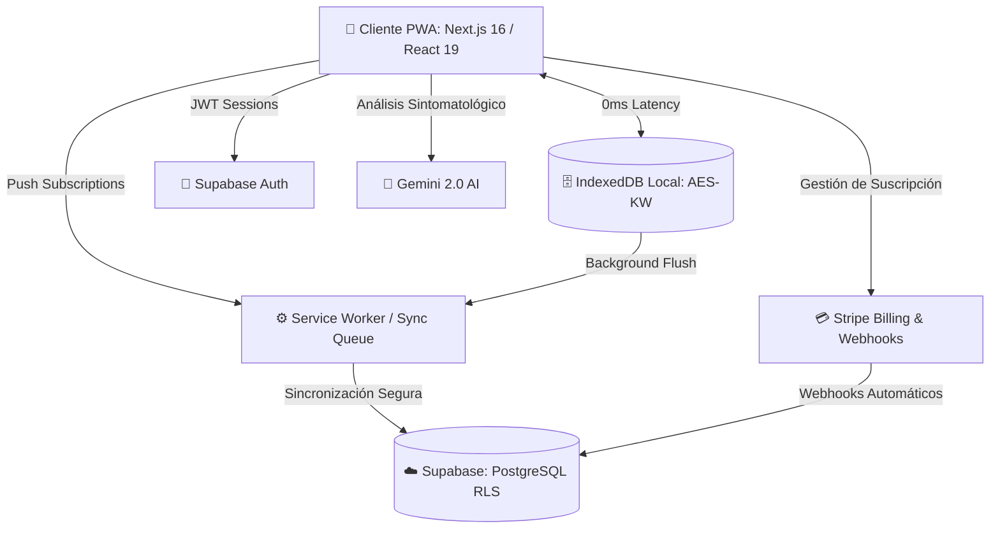

<div align="center">
  
  <h1>Glyph — Motor Clínico Inteligente ⚕️</h1>
  
  <p>
    <strong>La nueva generación de historias clínicas SaaS: Offline-First, IA-Powered y Segura.</strong>
  </p>

  <p>
    <a href="https://nextjs.org/"></a>
    <a href="https://react.dev/"></a>
    <a href="https://supabase.com/"></a>
    <a href="https://tailwindcss.com/"></a>
    <a href="https://stripe.com/"></a>
    <a href="https://playwright.dev/"></a>
  </p>
  
  <p>
    
    
    
    
  </p>
</div>

---

## 🌟 Visión General

**Glyph** no es solo un gestor de pacientes; es un **Motor Clínico Inteligente** diseñado para médicos modernos que exigen rapidez, seguridad y resiliencia tecnológica. Ha sido construido desde cero para soportar condiciones extremas: funciona perfectamente en áreas rurales sin conexión a internet y se sincroniza mágicamente en la nube cuando la red vuelve.

Diseñado con una arquitectura multi-tenant de grado empresarial, Glyph automatiza la facturación, los seguimientos y la codificación de enfermedades, devolviéndole a los médicos lo más importante: **su tiempo**.

---

## 🚀 Características Principales

### 📶 Arquitectura Offline-First (Resiliencia Extrema)
- **Local-First:** Todo el motor de la clínica corre directamente en el navegador del usuario utilizando **IndexedDB**, garantizando tiempos de respuesta de 0 milisegundos.
- **Background Sync Queue:** Si el usuario pierde la conexión, la aplicación sigue funcionando. Todas las consultas, actualizaciones y creación de pacientes se encolan silenciosamente.
- **Worker Inteligente:** Al recuperar el internet, un worker transaccional despacha la cola hacia Supabase, manejando reintentos con *backoff exponencial* y resolución de conflictos por relaciones (ej. crea al paciente *antes* de crear su consulta médica).

### 🤖 Asistente Médico de Inteligencia Artificial
- **Integración con Gemini 2.0:** El módulo de IA lee automáticamente los síntomas dictados o escritos por el médico y sugiere diagnósticos con códigos internacionales **CIE-10**.
- Interfaz no intrusiva: El médico siempre tiene la última palabra antes de sellar el diagnóstico en la base de datos inmutable.

### 🔐 Seguridad y Auditoría de Grado Bancario
- **Logs Inmutables (Blockchain-style):** Cada consulta sellada calcula un hash criptográfico concatenado con el registro anterior (`entry_hash`, `previous_hash`), impidiendo manipulaciones maliciosas de la historia clínica en la base de datos.
- **Encriptación AES-KW:** La base de datos local cifra todos los datos sensibles de salud (PHI) para que no puedan ser extraídos del dispositivo si el portátil es robado.
- **Content Security Policy (CSP):** Next.js pre-configurado con cabeceras estrictas que previenen ataques XSS protegiendo a los pacientes y al negocio.

### 💰 Facturación y Suscripciones B2B
- Integración completa y automatizada con **Stripe Webhooks** y **Stripe Customer Portal**.
- Manejo dinámico de estados de membresía (`active`, `past_due`, `canceled`, `lifetime`).
- Si la tarjeta rebota, el sistema bloquea amablemente el acceso premium hasta que se regularice la cuenta.

### 📲 PWA y Notificaciones Push (Web Push API)
- Aplicación instalable (PWA) en iOS, Android, macOS y Windows.
- **Notificaciones Push Nativas:** Soporte integrado con `web-push` y Service Workers para enviar recordatorios de pacientes directamente a la pantalla de bloqueo del dispositivo del médico.

### 👨‍💻 Panel de Super Admin
- Dashboard privado y protegido (`/admin`) para la gestión maestra de la plataforma.
- Métricas financieras en tiempo real.
- Panel de telemetría para monitorear errores de sincronización abandonados en dispositivos remotos.

---

## 🏗️ Arquitectura del Sistema



---

## 🛠️ Stack Tecnológico Definitivo

| Componente | Tecnología |
| :--- | :--- |
| **Framework & UI** | Next.js 16 (App Router), React 19, Tailwind CSS v4, Lucide Icons |
| **Backend & Base de Datos** | Supabase (PostgreSQL 15), pg_cron, RLS (Row Level Security) |
| **Procesamiento Offline** | IndexedDB (`idb`), Web Workers, PWA Manifest |
| **Seguridad & Criptografía** | Web Crypto API (AES-KW), SHA-256 (Auditoría), CSP Headers |
| **Machine Learning** | Google Gemini API (`gemini-2.0-flash`) |
| **Infraestructura de Pagos** | Stripe API, Stripe Webhooks, Customer Portal |
| **Notificaciones** | Web Push API, Service Workers, VAPID Keys |
| **Testing Automatizado** | Playwright (E2E), Vitest (Unitarios/Integración) |

---

## 💻 Guía Rápida de Instalación

### 1. Clonar el repositorio e instalar dependencias
```bash
git clone https://github.com/tu-usuario/glyph-hce.git
cd glyph-hce
npm install
```

### 2. Variables de Entorno (`.env.local`)
Duplica el archivo `.env.example` y renómbralo a `.env.local`. Necesitarás llenar:
- Credenciales de Supabase (`URL` y `ANON_KEY`)
- Credenciales del Admin Panel (`SERVICE_ROLE_KEY`)
- Llaves VAPID para notificaciones Push (`npx web-push generate-vapid-keys`)
- Google Gemini API Key
- Llaves de Stripe (Públicas, Secretas y Webhook Secret)

### 3. Migración de Base de Datos
Toda la base de datos, funciones, triggers y políticas RLS están concentradas en un script maestro seguro e idempotente.
1. Abre tu proyecto en Supabase → **SQL Editor**.
2. Copia y pega el contenido de `src/lib/supabase/000_production_full_schema.sql`.
3. Ejecútalo. ¡Tu infraestructura backend está lista en 3 segundos!

### 4. Lanzar Entorno de Desarrollo
```bash
npm run dev
```
La aplicación estará disponible en `http://localhost:3000`.

---

## 🧪 Testing y Control de Calidad (QA)

Glyph cuenta con una suite de pruebas automatizada preparada para Integración Continua (CI/CD) en GitHub Actions.

```bash
# Ejecutar Linter y Typecheck estricto
npm run lint && npm run typecheck

# Ejecutar pruebas unitarias de negocio y algoritmos de cifrado
npm run test

# Ejecutar suite de pruebas End-to-End en navegadores reales
npm run test:e2e
```
> **Nota E2E:** Para pruebas E2E contra la base de datos, asegúrate de definir `E2E_EMAIL` y `E2E_PASSWORD` en tus variables de entorno para que Playwright pueda inyectar la sesión fantasma. Las pruebas incluyen **Simulación de Pérdida de Conexión y Reconexión Automática**.

---

<div align="center">
  <br>
  <strong>Hecho con ❤️ para revolucionar la tecnología en salud digital.</strong>
  <br><br>
  <sub>Distribuido bajo licencia MIT.</sub>
</div>
