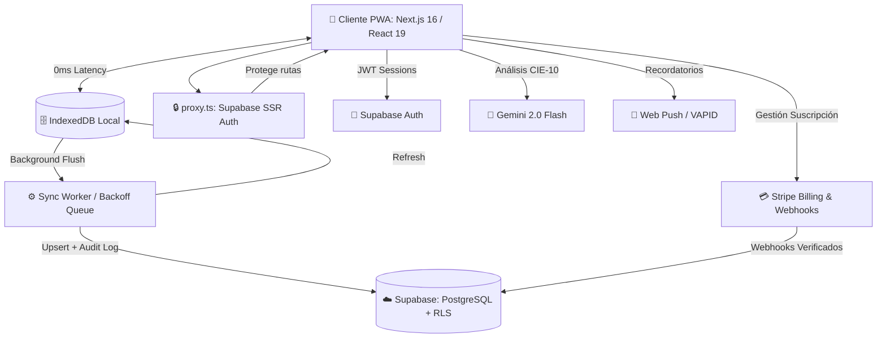

<div align="center">
  
  <h1>Glyph — Motor Clínico Inteligente ⚕️</h1>
  
  <p>
    <strong>Historia clínica electrónica SaaS: Offline-First, IA-Powered y Multi-tenant.</strong>
  </p>

  <p>
    <a href="https://nextjs.org/"></a>
    <a href="https://react.dev/"></a>
    <a href="https://supabase.com/"></a>
    <a href="https://tailwindcss.com/"></a>
    <a href="https://stripe.com/"></a>
    <a href="https://playwright.dev/"></a>
  </p>
  
  <p>
    
    
    
    
    
    
  </p>

</div>

---

## 🌟 Visión General

**Glyph** es un **Motor Clínico Inteligente** para médicos modernos que exigen rapidez, seguridad y resiliencia tecnológica. Construido desde cero para funcionar en condiciones extremas: trabaja perfectamente sin conexión a internet y sincroniza automáticamente en la nube cuando la red vuelve.

Con arquitectura multi-tenant de grado empresarial, Glyph automatiza la facturación, los seguimientos y la codificación de enfermedades — devolviendo a los médicos su recurso más valioso: **el tiempo**.

---

## 🚀 Características Principales

### 📶 Arquitectura Offline-First
- **Local-First:** Todo el motor clínico corre en el navegador usando **IndexedDB**, con tiempos de respuesta de 0ms.
- **Background Sync Queue:** Si se pierde la conexión, la app sigue funcionando. Las consultas y pacientes se encolan silenciosamente.
- **Worker Inteligente:** Al recuperar el internet, un sync worker despacha la cola hacia Supabase con *backoff exponencial* y resolución de conflictos por dependencias (crea al paciente antes de su consulta).
- **Online-First Refresh:** Refresh silencioso desde Supabase al cargar, manteniendo datos actualizados sin sacrificar la experiencia offline.

### 🤖 Asistente de IA — CIE-10
- **Gemini 2.0 Flash:** Lee los síntomas en tiempo real y sugiere diagnósticos con códigos **CIE-10** contextualizados a la especialidad.
- No intrusivo: el médico siempre valida antes de sellar el diagnóstico.
- **Rate Limiting por RPC:** Endpoint protegido por función Postgres que limita el uso por tenant.

### 📋 Plantillas de Tratamiento (multi-dispositivo)
- Plantillas reutilizables por médico, almacenadas en **Supabase** (migradas de localStorage).
- **Versionado automático:** Cada edición genera un snapshot `{ version, notes, updated_at }` en el campo JSONB `versions`.
- Migración automática de datos legacy al primer login post-actualización.
- Búsqueda global integrada (`Ctrl/Cmd + K`) sobre plantillas, pacientes y consultas.

### 🔐 Seguridad y Auditoría
- **`src/proxy.ts`:** Proxy SSR de Supabase en Next.js 16 — autentica y refresca sesiones en cada request.
- **RLS en todas las tablas:** El backend nunca expone datos de otra clínica.
- **Logs Inmutables:** Cada consulta sellada calcula un hash criptográfico encadenado (`entry_hash` + `previous_hash`) — imposible de manipular sin detección.
- **CSP Headers:** Cabeceras estrictas en `next.config.ts` contra XSS, clickjacking y otras amenazas.
- **Sin secretos en código:** Todo vía variables de entorno validadas en servidor.

### 💰 Facturación y Suscripciones
- **Stripe Webhooks** verificados con firma criptográfica.
- Estados de membresía: `active`, `trialing`, `past_due`, `canceled`, `lifetime`.
- **Stripe Customer Portal** para que el usuario gestione su propia suscripción.
- Si el pago falla, el acceso premium se bloquea de forma elegante.

### 📲 PWA y Notificaciones Push
- Instalable como app nativa en iOS, Android, macOS y Windows.
- **Web Push Notifications** con VAPID — recordatorios directamente en pantalla de bloqueo.
- Endpoint `/api/push/send` soporta llamadas autenticadas por sesión **o** por `x-push-secret` header para cron jobs.

### 👨‍💻 Panel de Super Admin
- Dashboard privado `/admin` con métricas de usuarios activos, lifetime, sin plan.
- Telemetría de errores de sincronización abandonados.
- Controlado exclusivamente por `ADMIN_EMAIL` — sin datos de identidad en el código.

---

## 🏗️ Arquitectura del Sistema



---

## 🛠️ Stack Tecnológico

| Componente | Tecnología |
| :--- | :--- |
| **Framework & UI** | Next.js 16 (App Router, Webpack), React 19, Tailwind CSS v4, Lucide Icons |
| **Backend & BD** | Supabase (PostgreSQL), RLS, pg_cron, PostgrestVersion 14.5 |
| **Estado & Cache** | TanStack Query v5 (`staleTime` configurado), IndexedDB (`idb`) |
| **Seguridad** | Supabase SSR proxy.ts, CSP Headers, HSTS, Stripe Webhook Signatures |
| **Machine Learning** | Google Gemini API (`gemini-2.0-flash`), Rate Limiting por RPC Postgres |
| **Infraestructura de Pagos** | Stripe API v2026-04-22, Webhooks, Customer Portal |
| **Notificaciones** | Web Push API, Service Workers, VAPID Keys |
| **Testing** | Vitest (85 tests unitarios/integración), Playwright (E2E) |

---

## 💻 Guía Rápida de Instalación

### 1. Clonar e instalar
```bash
git clone https://github.com/khryazid/HCE.git
cd HCE
npm install
```

### 2. Variables de Entorno (`.env.local`)
Duplica `.env.example` → `.env.local`. Variables requeridas:

```bash
# Supabase
NEXT_PUBLIC_SUPABASE_URL=
NEXT_PUBLIC_SUPABASE_ANON_KEY=
SUPABASE_SERVICE_ROLE_KEY=           # solo servidor (webhooks, admin)

# Stripe
STRIPE_SECRET_KEY=
STRIPE_WEBHOOK_SECRET=
NEXT_PUBLIC_STRIPE_PRICE_ID=
NEXT_PUBLIC_STRIPE_PUBLISHABLE_KEY=
NEXT_PUBLIC_SITE_URL=

# Gemini IA
GEMINI_API_KEY=
GEMINI_MODEL=gemini-2.0-flash

# Notificaciones Push (VAPID)
NEXT_PUBLIC_VAPID_PUBLIC_KEY=
VAPID_PRIVATE_KEY=
VAPID_MAILTO=mailto:soporte@tu-dominio.com

# Admin Panel
ADMIN_EMAIL=tu-email@ejemplo.com

# Push secret para cron jobs / webhooks de Supabase
# Genera con: openssl rand -hex 32
PUSH_SEND_SECRET=

# Solo desarrollo local — para regenerar tipos con npm run db:types
# Obtener en: https://supabase.com/dashboard/account/tokens
SUPABASE_ACCESS_TOKEN=sbp_xxxx
```

> ⚠️ `ADMIN_EMAIL`, `SUPABASE_SERVICE_ROLE_KEY` y `PUSH_SEND_SECRET` son exclusivos del servidor. Nunca los expongas con prefijo `NEXT_PUBLIC_`.  
> ⚠️ `SUPABASE_ACCESS_TOKEN` es **solo local** — no va en Vercel.

### 3. Base de Datos

El schema completo vive en un **único archivo SQL** (fuente de verdad):

```
supabase/migrations/000_production_full_schema.sql
```

**Aplicar:**
1. Supabase → SQL Editor → pega el archivo completo → Run.
2. Es idempotente: seguro re-ejecutarlo en cualquier momento.

**Regenerar tipos TypeScript** (después de cada cambio de schema):
```bash
npm run db:types
```

📖 Guía completa de base de datos: [docs/SUPABASE_MIGRATIONS.md](docs/SUPABASE_MIGRATIONS.md)

### 4. Claves VAPID (primera vez)
```bash
npx web-push generate-vapid-keys
```

### 5. Lanzar en desarrollo
```bash
npm run dev
```
Disponible en `http://localhost:3000`.

> **Nota:** `--webpack` en `npm run dev` es intencional. Turbopack (por defecto en Next.js 16) tiene incompatibilidades con `next-pwa` y el Web Worker del sync. Se migrará cuando se resuelvan upstream.

---

## 🧪 Testing y QA

```bash
# TypeScript — 0 errores
npx tsc --noEmit

# ESLint
npm run lint

# Tests unitarios e integración (85 tests)
npm run test

# End-to-End en navegadores reales
npm run test:e2e
```

> **E2E:** Define `E2E_EMAIL` y `E2E_PASSWORD` en `.env.local` para que Playwright inyecte la sesión. Los tests incluyen simulación de pérdida de conexión y reconexión automática.

---

## 📁 Estructura del Proyecto

```
src/
├── app/                    # Next.js App Router — páginas y API routes
│   ├── (auth)/             # Login, registro, onboarding
│   ├── (dashboard)/        # Dashboard, pacientes, consultas, admin, billing, tratamientos
│   └── api/                # Stripe webhooks, push notifications, IA CIE-10
├── features/               # Lógica de negocio por dominio
│   ├── admin/              # Panel super admin
│   ├── auth/               # Formularios y flujos de autenticación
│   ├── billing/            # Integración Stripe + portal
│   ├── consultations/      # Wizard de consulta, PDF, IA CIE, plantillas de tratamiento
│   ├── dashboard/          # Métricas, búsqueda global, letterhead
│   ├── patients/           # CRUD de pacientes
│   └── sync/               # Bootstrap del sync worker
├── lib/
│   ├── constants/          # Especialidades médicas y constantes compartidas
│   ├── db/                 # IndexedDB schema + queries locales
│   ├── observability/      # Logger de errores, app events
│   ├── supabase/           # Cliente SSR/browser, profile, tenant context, onboarding
│   └── sync/               # Sync worker con backoff exponencial
├── proxy.ts                # Punto de entrada del proxy SSR de Next.js 16
│                           # (equivalente al antiguo middleware.ts, deprecado en Next 16)
└── types/                  # supabase.types.ts (generado con npm run db:types)
supabase/
└── migrations/
    └── 000_production_full_schema.sql   # Única fuente de verdad del schema
docs/
├── BACKLOG.md              # Bugs, features futuras y sprint tasklist
├── SUPABASE_MIGRATIONS.md  # Guía para añadir tablas y regenerar tipos
├── DESIGN_SYSTEM.md        # Tokens de diseño y componentes UI
└── 001-ADR-arquitectura-base.md
tests/                      # Vitest: unit + integración (85 tests)
scripts/
└── sync-supabase-schema.mjs   # Genera src/types/supabase.types.ts (npm run db:types)
```

---

## 📋 Scripts Disponibles

| Script | Descripción |
|--------|-------------|
| `npm run dev` | Servidor de desarrollo (webpack) |
| `npm run build` | Build de producción |
| `npm run lint` | ESLint sobre todo `src/` |
| `npm run typecheck` | TypeScript sin emitir archivos |
| `npm run test` | Suite Vitest (85 tests) |
| `npm run test:e2e` | Suite Playwright E2E |
| `npm run db:types` | Regenera `src/types/supabase.types.ts` desde Supabase |

---

## 🗺️ Próximas Features

Ver el tasklist completo con prioridades en **[docs/BACKLOG.md](docs/BACKLOG.md)**.

Las más próximas:
1. **PDF con firma y membrete del doctor** — datos del `onboarding_profile` ya guardados
2. **Notificaciones push para seguimientos** — infraestructura VAPID ya lista, falta el cron job
3. **Panel Admin completo** — gestión de suscripciones sin depender de Supabase Dashboard

---

<div align="center">
  <br>
  <strong>Hecho con ❤️ para revolucionar la tecnología en salud digital.</strong>
  <br><br>
  <sub>Distribuido bajo licencia MIT.</sub>
</div>
