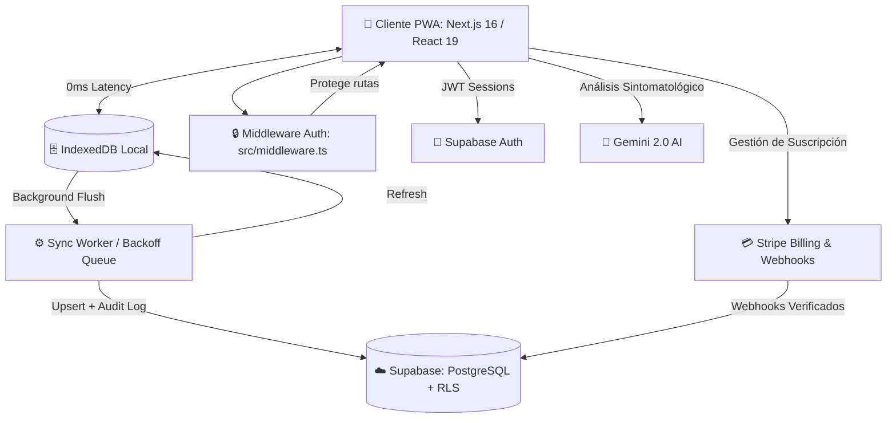

<div align="center">
  
  <h1>Glyph — Motor Clínico Inteligente ⚕️</h1>
  
  <p>
    <strong>La nueva generación de historias clínicas SaaS: Offline-First, IA-Powered y Segura.</strong>
  </p>

  <p>
    <a href="https://nextjs.org/"></a>
    <a href="https://react.dev/"></a>
    <a href="https://supabase.com/"></a>
    <a href="https://tailwindcss.com/"></a>
    <a href="https://stripe.com/"></a>
    <a href="https://playwright.dev/"></a>
  </p>
  
  <p>
    
    
    
    
    
  </p>

</div>

---

## 🌟 Visión General

**Glyph** no es solo un gestor de pacientes; es un **Motor Clínico Inteligente** diseñado para médicos modernos que exigen rapidez, seguridad y resiliencia tecnológica. Ha sido construido desde cero para soportar condiciones extremas: funciona perfectamente en áreas rurales sin conexión a internet y se sincroniza automáticamente en la nube cuando la red vuelve.

Diseñado con una arquitectura multi-tenant de grado empresarial, Glyph automatiza la facturación, los seguimientos y la codificación de enfermedades, devolviéndole a los médicos lo más importante: **su tiempo**.

---

## 🚀 Características Principales

### 📶 Arquitectura Offline-First (Resiliencia Extrema)
- **Local-First:** Todo el motor de la clínica corre directamente en el navegador del usuario utilizando **IndexedDB**, garantizando tiempos de respuesta de 0 milisegundos.
- **Background Sync Queue:** Si el usuario pierde la conexión, la aplicación sigue funcionando. Todas las consultas, actualizaciones y creación de pacientes se encolan silenciosamente.
- **Worker Inteligente:** Al recuperar el internet, un worker transaccional despacha la cola hacia Supabase, manejando reintentos con *backoff exponencial* y resolución de conflictos por relaciones (ej. crea al paciente *antes* de crear su consulta médica).
- **Online-First Refresh:** Al cargar la vista de pacientes, se hace un refresh silencioso desde Supabase antes de leer el caché local, manteniendo los datos actualizados sin sacrificar la experiencia offline.

### 🤖 Asistente Médico de Inteligencia Artificial
- **Integración con Gemini 2.0:** El módulo de IA lee automáticamente los síntomas dictados o escritos por el médico y sugiere diagnósticos con códigos internacionales **CIE-10**.
- Interfaz no intrusiva: El médico siempre tiene la última palabra antes de sellar el diagnóstico en la base de datos inmutable.
- **Rate Limiting por RPC:** El endpoint de sugerencias IA está protegido por una función RPC en Supabase que limita el uso por tenant.

### 🔐 Seguridad y Auditoría de Grado Bancario
- **Middleware de autenticación activo en todas las rutas:** `src/middleware.ts` ejecuta el proxy de Supabase SSR en cada request, refrescando sesiones y bloqueando acceso no autenticado a `/dashboard`, `/pacientes`, `/consultas`, `/billing`, `/admin` y más.
- **Logs Inmutables:** Cada consulta sellada calcula un hash criptográfico concatenado con el registro anterior (`entry_hash`, `previous_hash`), impidiendo manipulaciones maliciosas de la historia clínica.
- **Content Security Policy (CSP):** Cabeceras estrictas configuradas en `next.config.ts` que previenen XSS, clickjacking y otras amenazas comunes.
- **RLS en Supabase:** Todas las tablas están protegidas por Row Level Security — el backend nunca expone datos de otra clínica.
- **Variables de entorno para secretos:** Sin emails ni claves hardcodeadas en el código fuente.

### 💰 Facturación y Suscripciones B2B
- Integración completa y automatizada con **Stripe Webhooks** y **Stripe Customer Portal**.
- Manejo dinámico de estados de membresía (`active`, `past_due`, `canceled`, `lifetime`).
- Webhook verificado con firma criptográfica; errores de BD retornan HTTP 500 para forzar reintentos de Stripe.
- Si la tarjeta rebota, el sistema bloquea amablemente el acceso premium hasta que se regularice la cuenta.

### 📲 PWA y Notificaciones Push (Web Push API)
- Aplicación instalable (PWA) en iOS, Android, macOS y Windows.
- **Notificaciones Push Nativas:** Soporte integrado con `web-push` y Service Workers para enviar recordatorios directamente a la pantalla de bloqueo del dispositivo.
- Endpoint `/api/push/send` soporta llamadas autenticadas por sesión de usuario **o** por secret header (`x-push-secret`) para integraciones con cron jobs y webhooks de Supabase.

### 👨‍💻 Panel de Super Admin
- Dashboard privado y protegido (`/admin`) para la gestión maestra de la plataforma.
- Métricas financieras en tiempo real: usuarios activos, lifetime, inactivos, sin plan.
- Panel de telemetría para monitorear errores de sincronización abandonados en dispositivos remotos.
- Acceso controlado por variable de entorno `ADMIN_EMAIL` — sin datos de identidad en el código fuente.

---

## 🏗️ Arquitectura del Sistema



---

## 🛠️ Stack Tecnológico

| Componente | Tecnología |
| :--- | :--- |
| **Framework & UI** | Next.js 16 (App Router, Webpack), React 19, Tailwind CSS v4, Lucide Icons |
| **Backend & Base de Datos** | Supabase (PostgreSQL 15), RLS (Row Level Security), pg_cron |
| **Estado & Cache** | TanStack Query v5, IndexedDB (`idb`) — offline-first |
| **Seguridad** | Supabase SSR Middleware, CSP Headers, HSTS, Stripe Webhook Signatures |
| **Machine Learning** | Google Gemini API (`gemini-2.0-flash`), Rate Limiting por RPC |
| **Infraestructura de Pagos** | Stripe API v2026-04-22, Webhooks, Customer Portal |
| **Notificaciones** | Web Push API, Service Workers, VAPID Keys |
| **Testing Automatizado** | Vitest (85 tests unitarios/integración), Playwright (E2E) |

---

## 💻 Guía Rápida de Instalación

### 1. Clonar e instalar dependencias
```bash
git clone https://github.com/tu-usuario/glyph-hce.git
cd glyph-hce
npm install
```

### 2. Variables de Entorno (`.env.local`)
Duplica `.env.example` y renómbralo a `.env.local`. Variables requeridas:

```bash
# Supabase
NEXT_PUBLIC_SUPABASE_URL=
NEXT_PUBLIC_SUPABASE_ANON_KEY=
SUPABASE_SERVICE_ROLE_KEY=        # solo servidor (webhooks)

# Stripe
STRIPE_SECRET_KEY=
STRIPE_WEBHOOK_SECRET=
NEXT_PUBLIC_STRIPE_PRICE_ID=
NEXT_PUBLIC_SITE_URL=

# Gemini IA
GEMINI_API_KEY=

# Notificaciones Push VAPID
NEXT_PUBLIC_VAPID_PUBLIC_KEY=
VAPID_PRIVATE_KEY=
VAPID_MAILTO=mailto:soporte@tu-dominio.com

# Admin Panel
ADMIN_EMAIL=tu-email-de-admin@ejemplo.com  # acceso exclusivo a /admin

# Push (para cron jobs / webhooks de Supabase)
# Genera con: node -e "console.log(require('crypto').randomBytes(32).toString('hex'))"
PUSH_SEND_SECRET=
```

> **Nota:** `ADMIN_EMAIL` nunca debe quedar en el código fuente. Se lee exclusivamente desde el servidor vía `process.env`.

### 3. Base de Datos — Migraciones
El schema de producción vive en `supabase/migrations/`. Para aplicarlo:
1. Ve a **Supabase → SQL Editor** de tu proyecto.
2. Ejecuta `supabase/migrations/000_production_full_schema.sql`.

Para generar las claves VAPID:
```bash
npx web-push generate-vapid-keys
```

### 4. Lanzar Entorno de Desarrollo
```bash
npm run dev
```
Disponible en `http://localhost:3000`.

> **Nota:** El flag `--webpack` en `npm run dev` es intencional. Turbopack (por defecto en Next.js 16) tiene incompatibilidades con `next-pwa` y el bundling del Sync Worker. Se migrará a Turbopack cuando esas incompatibilidades se resuelvan upstream.

---

## 🧪 Testing y Control de Calidad

Suite de pruebas automatizadas lista para CI/CD en GitHub Actions.

```bash
# TypeScript — 0 errores
npx tsc --noEmit

# Linter
npm run lint

# Pruebas unitarias e integración (85 tests)
npm run test

# Suite End-to-End en navegadores reales
npm run test:e2e
```

> **Nota E2E:** Para pruebas contra la base de datos, define `E2E_EMAIL` y `E2E_PASSWORD` en tus variables de entorno para que Playwright pueda inyectar la sesión. Los tests incluyen **Simulación de Pérdida de Conexión y Reconexión Automática**.

---

## 📁 Estructura del Proyecto

```
src/
├── app/                    # Next.js App Router — páginas y API routes
│   ├── (auth)/             # Login, registro, onboarding
│   ├── (dashboard)/        # Dashboard, pacientes, consultas, admin, billing
│   └── api/                # Stripe webhooks, push notifications, IA (CIE)
├── features/               # Lógica de negocio por dominio
│   ├── admin/              # Panel super admin
│   ├── auth/               # Formularios y flujos de autenticación
│   ├── billing/            # Integración Stripe
│   ├── consultations/      # Wizard de consulta, PDF, IA CIE
│   ├── dashboard/          # Métricas, letterhead, perfil profesional
│   └── patients/           # CRUD de pacientes
├── lib/
│   ├── constants/          # Constantes compartidas (sync, medical specialties)
│   ├── db/                 # IndexedDB schema + queries locales
│   ├── observability/      # Error logger, app events
│   ├── supabase/           # Cliente SSR/browser, middleware, profile
│   └── sync/               # Sync worker con backoff exponencial
├── proxy.ts                # ⚠️ Punto de entrada del proxy de Next.js (antes: middleware.ts)
└── types/                  # Tipos globales: Supabase DB, SyncQueue
supabase/
└── migrations/             # Schema SQL de producción
tests/                      # Vitest: unit + integración
```

---

<div align="center">
  <br>
  <strong>Hecho con ❤️ para revolucionar la tecnología en salud digital.</strong>
  <br><br>
  <sub>Distribuido bajo licencia MIT.</sub>
</div>
