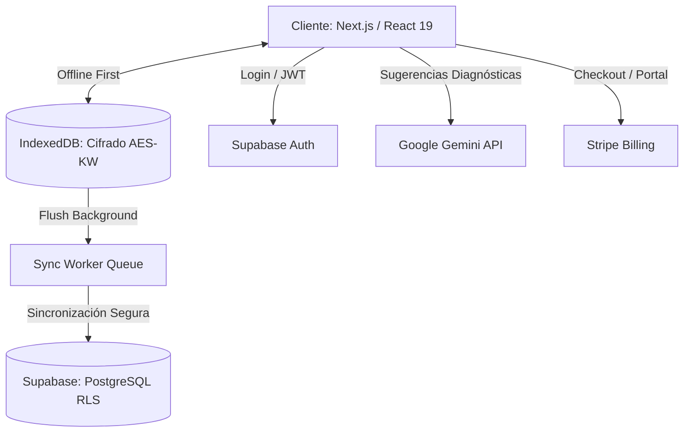

<div align="center">
  
  <h1>Glyph — Motor Clínico Inteligente ⚕️</h1>
  
  <p>
    <strong>Plataforma SaaS de historias clínicas multiespecialidad con enfoque offline-first, sincronización por cola y aislamiento multi-tenant.</strong>
  </p>

  <p>
    
    
    
    
    
    
  </p>
</div>

---

## 🌟 Descripción

**Glyph** permite gestionar pacientes, consultas y seguimientos clínicos con un enfoque radicalmente moderno:
- Soporte para **trabajo offline** total con sincronización en background.
- **Asistente IA (Gemini 2.0 Flash)** para sugerencias automáticas de codificación CIE-10.
- **Encriptación AES-KW** de alta entropía para datos de salud en el navegador.
- **Generación client-side de PDFs** médicos y recetas.

---

## 🚀 Estado Actual

| Métrica | Estado |
| --- | --- |
| **Versión** | `v1.0.0` |
| **Fase** | 🟢 Producción |
| **Calidad de Código** | 0 Errores TS, 0 Warnings ESLint |
| **Test Coverage** | 90+ Tests unitarios e integración en verde |

---

## ✨ Características Principales

### 🧠 Wizard de Consulta Asistido por IA
- Modo **Consulta Completa** y **Seguimiento Clínico**.
- Sugerencias **CIE-10 asistidas por Gemini AI** basadas en los síntomas, con mecanismo de *retry* automático.
- Antecedentes con listas de bullets automáticas y campos vitales (T.A.) con autoformato inteligente.

### 📶 Arquitectura Offline-First (Local-First)
- Persistencia local en **IndexedDB** con cifrado PHI (AES-KW).
- **Cola de sincronización robusta**: *Backoff* exponencial, manejo de conflictos, *dependency guards* para evitar violaciones de foreign keys.

### 📄 Generación de Documentos
- Generación de **PDFs multipágina** directamente en el cliente (sin pasar por servidores).
- Incluye historia clínica, receta farmacéutica y hoja del paciente.
- Membrete y firma digital personalizable por el profesional.

### 🛡️ Autenticación y Seguridad Multi-Tenant
- Login seguro vía **Supabase Auth**.
- **Row Level Security (RLS)** estricto: Aislamiento total de datos entre clínicas/doctores.
- Manejo graceful de tokens revocados o expirados.

### 💼 Admin Panel (Super Admin)
- Panel privado en `/admin` para gestionar suscripciones.
- Integración nativa con **Stripe**.
- Modificar planes, asignar tiempo *Lifetime*, desactivar o eliminar cuentas (con borrado en cascada seguro).

---

## 🛠️ Stack Tecnológico

| Capa | Tecnología |
| --- | --- |
| **Framework** | Next.js 16 (App Router) |
| **UI** | React 19 + TypeScript + Tailwind CSS |
| **Auth & DB** | Supabase (PostgreSQL + Auth) |
| **Almacenamiento Local** | IndexedDB (`idb`) + AES-KW Crypto |
| **Inteligencia Artificial**| Google Gemini (`gemini-2.0-flash`) |
| **Pagos** | Stripe |
| **Testing** | Vitest (Unit/Integration) + Playwright (E2E) |

---

## 🏗️ Arquitectura de Sistema



---

## 💻 Instalación y Arranque

### Requisitos previos
- Node.js 20+
- npm 10+
- Proyecto en Supabase (el plan gratuito es suficiente)

### Pasos

1. **Clonar e instalar dependencias:**
   ```bash
   git clone https://github.com/tu-usuario/hce-multiespecialidad.git
   cd hce-multiespecialidad
   npm install
   ```

2. **Configurar variables de entorno:**
   ```bash
   cp .env.example .env.local
   ```
   Rellena `.env.local` con tus credenciales de Supabase, Stripe y Gemini.

3. **Ejecutar el schema de base de datos:**
   - Abre `src/lib/supabase/000_production_full_schema.sql` en el SQL Editor de Supabase y ejecútalo.
   - Es seguro, idempotente, e incluye *todas* las tablas, políticas de RLS, funciones RPC y el *Cron Job* automático.

4. **Iniciar servidor en desarrollo:**
   ```bash
   npm run dev
   ```

---

## ⚙️ Variables de Entorno

| Variable | Descripción |
| --- | --- |
| `NEXT_PUBLIC_SUPABASE_URL` | URL de tu proyecto Supabase |
| `NEXT_PUBLIC_SUPABASE_ANON_KEY` | Clave anónima pública de Supabase |
| `SUPABASE_SERVICE_ROLE_KEY` | Clave de rol de servicio (**SOLO para el Admin Panel**). Nunca exponer en cliente. |
| `GEMINI_API_KEY` | Clave de Google AI Studio para motor diagnóstico. |
| `NEXT_PUBLIC_STRIPE_PRICE_ID` | ID del plan de suscripción de Stripe. |
| `STRIPE_SECRET_KEY` | Clave secreta de Stripe para webhooks y checkout. |
| `NEXT_PUBLIC_SITE_URL` | URL base de la app para retornos de Stripe. |

---

## 👨‍💻 Comandos Útiles

```bash
npm run dev              # Servidor de desarrollo
npm run build            # Build de producción
npm run lint             # ESLint
npm run typecheck        # Chequeo estricto TypeScript
npm run test             # Pruebas Vitest
npm run test:e2e         # Pruebas E2E (Playwright)
```

---

## 🔐 Admin Panel (Super Admin)

Panel exclusivo para administración de usuarios y facturación.
- **Acceso exclusivo:** Limitado por código a `khristian.yazid@gmail.com`. Cualquier otro usuario será redirigido.
- **Ruta:** `/admin`
- **Funcionalidades:** Dar días de suscripción, otorgar acceso vitalicio (*Lifetime*), cancelar suscripciones, y purgar cuentas del sistema.

---

## 📅 Changelog Reciente

### v1.0.0 — 2026-05-03 (Producción)
- 🚀 Despliegue listo para producción.
- 💳 Integración del Stripe Customer Portal para gestión de facturación y bajas (`/ajustes`).
- 👥 Admin Panel operativo y robusto (Manejo de estado *canceled*, *lifetime* y eliminación segura en cascada).
- 🕒 Integración del Cron Job (`pg_cron`) de KPIs embebido en el script SQL unificado.
- 🤖 Auto-scroll, máscaras DD/MM/AAAA y mejoras masivas de usabilidad en el Wizard Clínico.
- 🔒 Actualización de middleware Auth a validación robusta con `getUser()`.

---

<div align="center">
  Hecho con ❤️ para revolucionar la salud digital.
</div>
