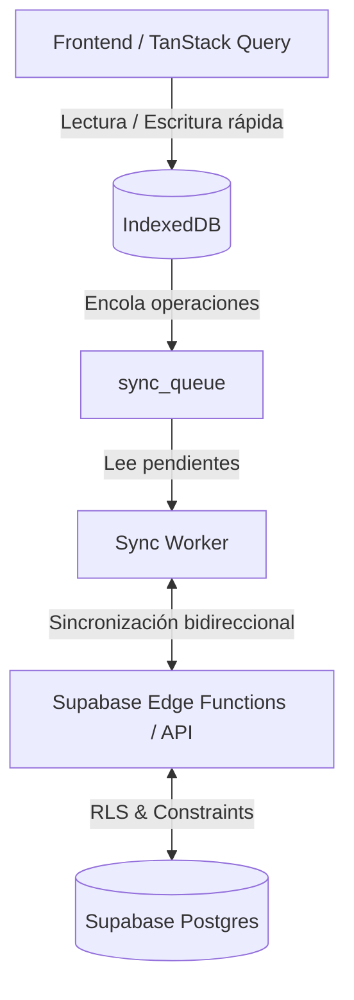

# 🏛️ Arquitectura de Glyphix

## Introducción
Glyphix está diseñado con un enfoque **Offline-First**, garantizando que los profesionales médicos puedan operar sin interrupciones incluso en entornos de conectividad inestable. Esta arquitectura se apoya en tres pilares fundamentales: **IndexedDB** para almacenamiento local, un **Sync Worker** para gestionar la sincronización en segundo plano, y **Supabase** como fuente de la verdad en la nube.

## Flujo de Datos Principal

### 1. Interfaz y Almacenamiento Local (IndexedDB)
Todas las interacciones del usuario (creación de pacientes, órdenes, notas de evolución) se escriben *inmediatamente* en la base de datos local del navegador (**IndexedDB**) a través de una capa de abstracción basada en promesas.
- **Ventaja**: Latencia cero percibida por el usuario.
- **Estado**: Los registros creados o modificados se marcan en una cola local (`sync_queue`) con un estado pendiente y un `client_timestamp`.

### 2. Sincronización en Segundo Plano (Sync Worker)
El **Sync Worker** actúa como el motor de orquestación de datos. 
- **Detección de Red**: Observa activamente el estado de conexión del navegador (`navigator.onLine`).
- **Procesamiento de la Cola**: Cuando hay red, extrae elementos pendientes de la `sync_queue` sin descifrar masivamente (optimizando la latencia y la memoria).
- **Backoff Exponencial**: Si falla una solicitud, reintenta con tiempos de espera incrementales y un límite robusto (`MAX_RETRIES = 50`) para proteger el historial clínico en desconexiones prolongadas.

### 3. Backend y Consolidación (Supabase)
Los datos llegan a Supabase a través de llamadas RPC o REST seguras.
- **Resolución de Conflictos**: El servidor utiliza el `client_timestamp` y un reloj centralizado para gestionar el clock-drift y resolver conflictos (Last-Write-Wins modificado para entidades clínicas).
- **Aislamiento**: Políticas de RLS (Row Level Security) aseguran que el trabajador solo sincronice los datos correspondientes al *Tenant* (clínica) y rol correctos.

